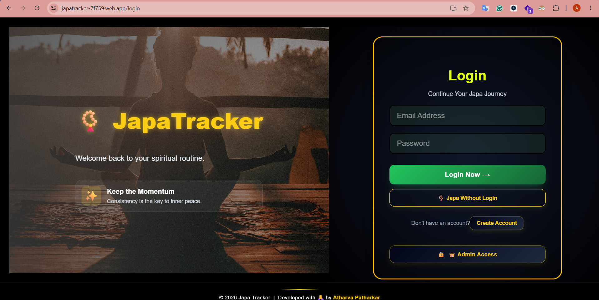
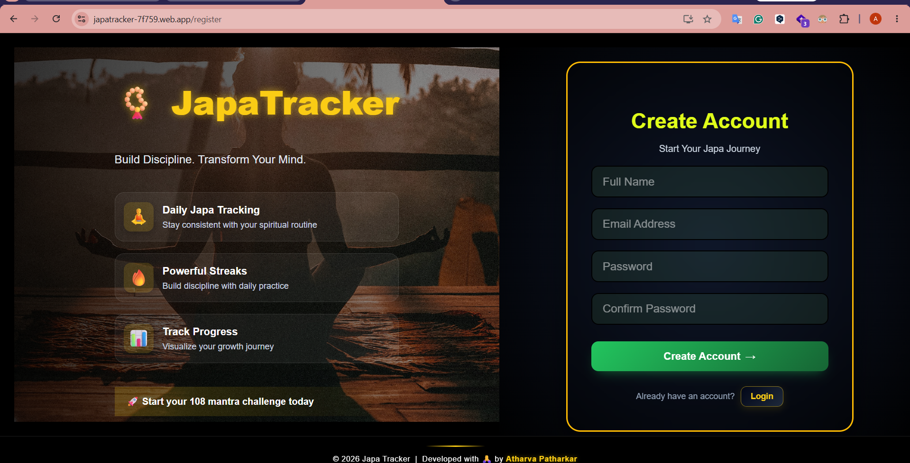
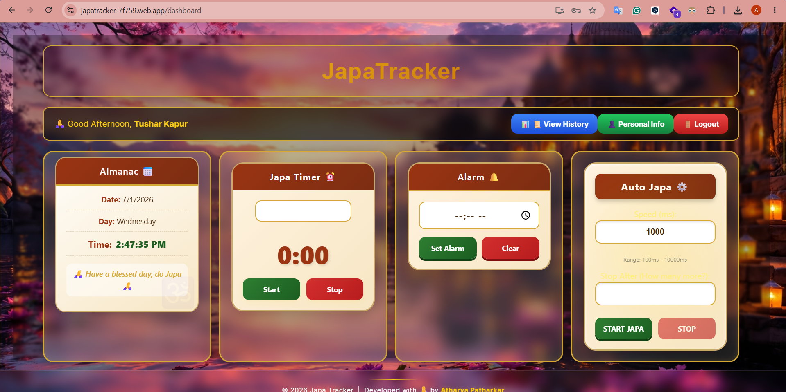
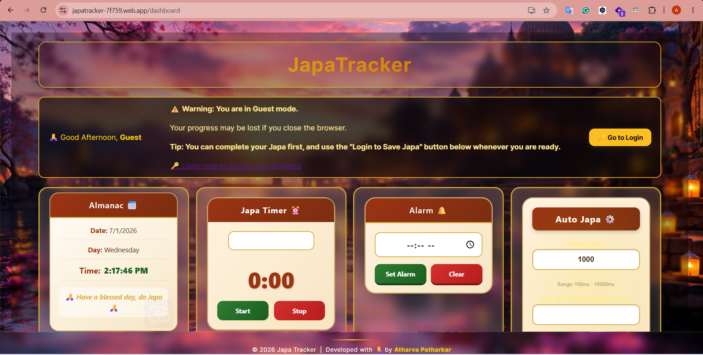
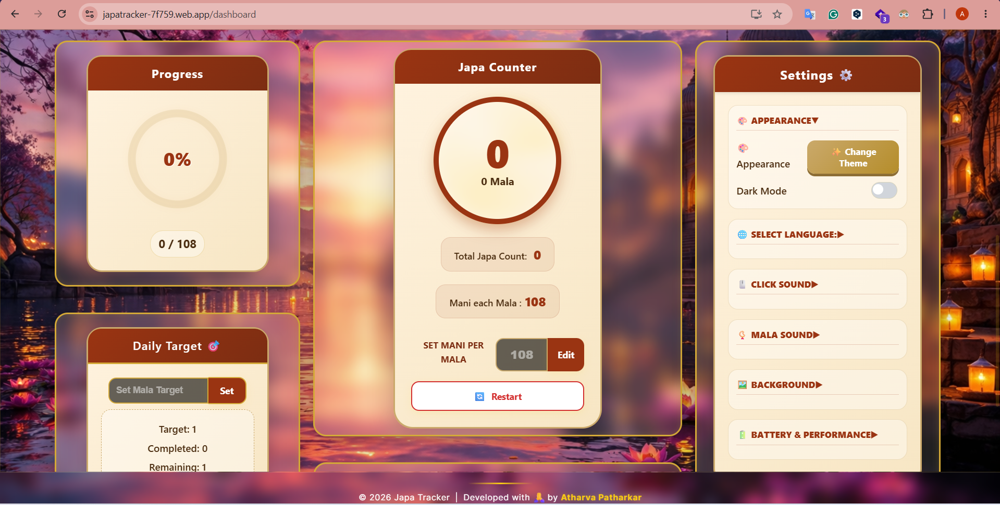
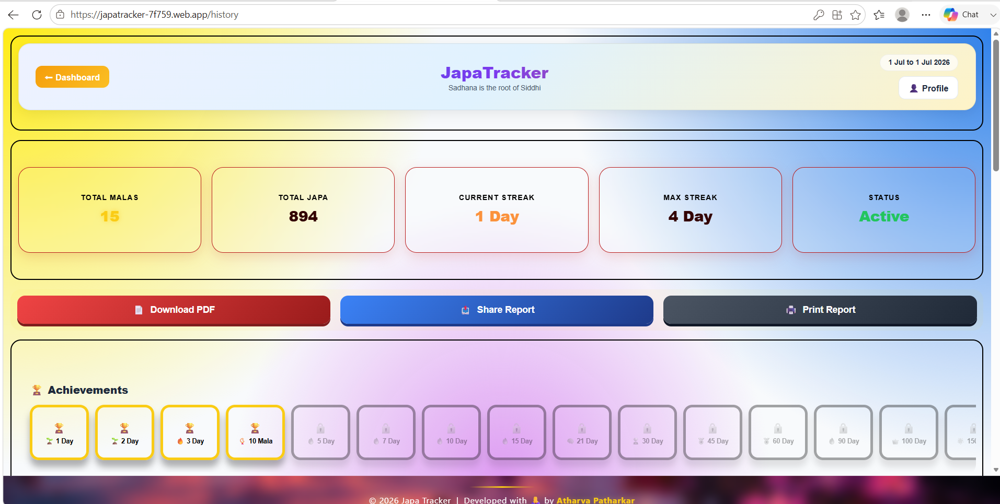
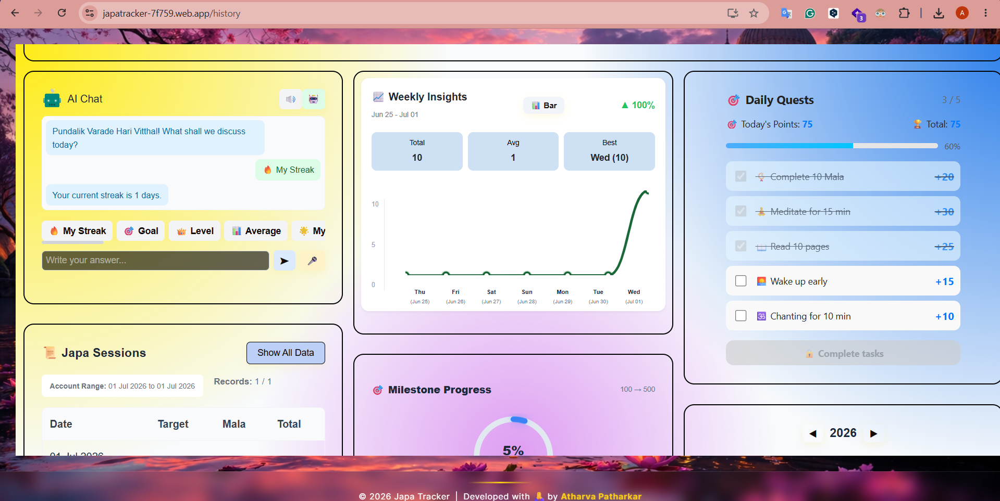
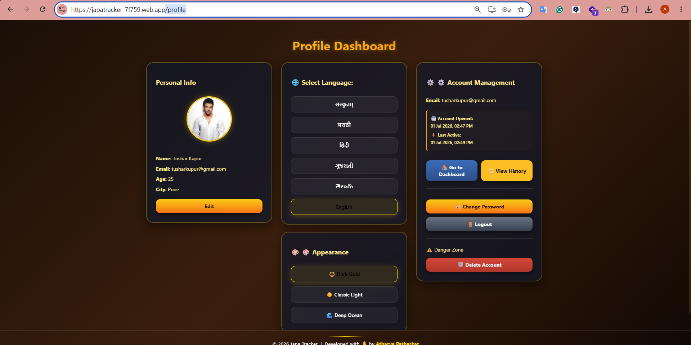

# 🕉️ JapaTracker


> **A Modern Spiritual Japa Tracking Progressive Web Application (PWA) built using Angular 21 and Firebase.**

---

# 1. 📖 Project Description

**JapaTracker** is a modern **Spiritual Japa Tracking Progressive Web Application (PWA)** developed using **Angular 21** and **Firebase**. The application helps users build a consistent daily chanting (Japa) habit by tracking mantra counts, malas, daily targets, streaks, achievements, and overall spiritual progress.

The application provides a clean and responsive interface with real-time synchronization, secure authentication, offline support, multilingual support, customizable themes, AI-powered insights, and comprehensive analytics.

Users can install JapaTracker directly from the browser as a **Progressive Web App (PWA)** without downloading it from the Google Play Store.

---

# 2. 🌐 Live Demo

### 🔗 Live Website

👉 **https://japatracker-7f759.web.app**

---

### 📱 Install as Mobile App

Open the above website in **Google Chrome** or **Microsoft Edge** and click **Install App** to install JapaTracker as a Progressive Web App (PWA).

No Play Store installation is required.

---
# 3. ⭐ Project Highlights

- 🚀 Built with **Angular 21** and **Firebase**
- 📱 Installable **Progressive Web Application (PWA)**
- 🔐 Secure **Firebase Authentication** with Login, Registration, Guest Mode, Password Management, and Account Deletion
- ☁️ Real-time cloud synchronization using **Cloud Firestore**
- 📿 Advanced **Japa Tracking Dashboard** with Counter, Mala Counter, Daily Targets, Progress Ring, Auto Japa, Alarm, and Japa Timer
- 📊 Comprehensive **History & Analytics Dashboard** featuring Total Japa, Total Malas, Current Streak, Maximum Streak, Weekly Insights, Calendar Heatmap, Focus Meter, Energy Meter, and Milestone Progress
- 📄 Generate, Download, Print, and Share **PDF Reports**
- 🤖 Integrated **AI Chat Assistant** for guidance and motivation
- 👤 Complete **Profile Management** with Profile Image Upload, Crop Tool, Password Change, and Personal Information Updates
- 🌍 Multi-language Support: **संस्कृतम्, Marathi, Hindi, Gujarati, Telugu, and English**
- 🎨 Multiple Application Themes: **Dark Gold, Classic Light, and Deep Ocean**
- 🖼 Custom Background Selection and Sound Controls
- ⚡ Optimized Performance with Battery Saver Mode and Responsive UI
- 📱 Fully Responsive Design for Mobile, Tablet, Laptop, and Desktop
- 🔄 Offline Support through Progressive Web App (PWA)
- 🔥 Hosted on **Firebase Hosting** with HTTPS Support
- 📈 Production Ready and Successfully Deployed
- 🧪 Unit Tested using **Vitest**
- 💻 Version Controlled using **Git & GitHub**

---

# 4. ✨ Features

## 🔐 Authentication

- Firebase Authentication
- User Registration
- Secure Login
- Guest Mode
- Logout
- Change Password
- Delete Account
- User Profile Management

---

## 📿 Dashboard

### 📅 Almanac

- Daily Spiritual Almanac

### ⏱ Japa Timer

- Meditation Timer
- Session Timer

### 🔔 Alarm

- Reminder Alarm
- Daily Notification Alerts

### 🤖 Auto Japa

- Automatic Counter
- Adjustable Speed
- Stop After Selected Count

### 📈 Progress

- Daily Progress Ring
- Completion Percentage
- Live Progress Status

### 🎯 Daily Target

- Set Daily Target
- Show Daily Progress
- Completion Indicator

### 📿 Japa Counter

- Counter Button
- Mala Counter
- Manual Counter
- Target Counter

### 🎮 Controls

- Save Progress
- Restart Counter

### ⚙️ Settings

#### 🎨 Appearance

- Change Theme
- Dark Mode

#### 🌍 Language Support

- संस्कृतम् (Sanskrit)
- Marathi
- Hindi
- Gujarati
- Telugu
- English

#### 🔊 Sound Controls

- Click Sound
- Mala Sound

#### 🖼 Background

- Background Image Selection

#### 🔋 Battery & Performance

- Battery Saver Mode
- Performance Mode

---

## 👤 Profile Dashboard

- Edit Profile
- Update Name
- Update Age
- Update City
- Change Password
- Upload Profile Image
- Image Crop Tool

---

## 📊 History & Analytics

### 📈 Statistics

- Total Malas
- Total Japa
- Current Streak
- Maximum Streak
- Status Overview

### 📄 Reports

- Download PDF
- Share Report
- Print Report

### 🏆 Achievements

- Achievement System
- Milestone Progress

### 🤖 AI Features

- AI Chat Assistant
- Weekly Insights
- Future Insight

### 📖 Japa Sessions

- View Complete Japa Records
- Delete Session History

### 📊 Analytics

- Calendar Heatmap
- Focus Meter
- Focus Trend
- Average Focus
- Best Session
- Worst Session
- Consistency Score
- Daily Quests
- Energy Meter
- Sadhana Prahara (Peak Practice Time)

---

## 🎨 Theme Support

- Dark Gold
- Classic Light
- Deep Ocean

---

## ☁ Firebase Integration

- Firebase Authentication
- Cloud Firestore
- Firebase Storage
- Firebase Hosting
- Real-time Data Synchronization

---

## 📱 Progressive Web App (PWA)

- Installable Web Application
- Offline Support
- Home Screen Installation
- Mobile Friendly
- Tablet Friendly
- Desktop Friendly
- Fast Loading
- Responsive Design

---

# 5. 🛠 Tech Stack

## Frontend

- Angular 21
- TypeScript
- HTML5
- CSS3
- Bootstrap 5
- Bootstrap Icons

---

## Backend & Cloud

- Firebase Authentication
- Cloud Firestore
- Firebase Storage
- Firebase Hosting

---

## Libraries & Packages

- Angular Fire
- RxJS
- Chart.js
- html2canvas
- jsPDF
- jsPDF AutoTable
- ngx-image-cropper
- Canvas Confetti

---

## Progressive Web App

- Angular Service Worker
- Progressive Web App (PWA)

---

## Development Tools

- Visual Studio Code
- Angular CLI
- Firebase CLI
- Git
- GitHub

---

## Testing

- Vitest
- Angular Testing Utilities

---

## Version Control

- Git
- GitHub


---


# 6. 🏗️ System Architecture

JapaTracker follows a modern **Client-Cloud Architecture** using **Angular 21** as the frontend and **Firebase** as the backend. The application securely authenticates users, stores data in Cloud Firestore, manages profile images in Firebase Storage, and is deployed using Firebase Hosting.

---

## Architecture Diagram

```text
                           👤 User
                              │
                              ▼
                  Google Chrome / Edge Browser
                              │
                              ▼
             Progressive Web App (Angular 21)
                              │
        ┌─────────────────────┼─────────────────────┐
        │                     │                     │
        ▼                     ▼                     ▼
 Firebase Authentication  Cloud Firestore   Firebase Storage
        │                     │                     │
        │                     │                     │
        │         User Data, History,              │
        │         Targets, Sessions,               │
        │         Achievements                     │
        │                     │                     │
        └─────────────────────┼─────────────────────┘
                              │
                              ▼
                    Firebase Hosting (HTTPS)
                              │
                              ▼
                https://japatracker-7f759.web.app
```

---

## Architecture Components

### 🖥️ Frontend

The frontend is developed using **Angular 21** with a responsive user interface. It manages user interactions, routing, animations, themes, language selection, and application logic.

Features:

- Responsive UI
- Standalone Components
- Angular Routing
- Angular Signals
- Services
- Pipes
- Forms
- Progressive Web App (PWA)

---

### 🔐 Firebase Authentication

Provides secure authentication for application users.

Features:

- User Registration
- Secure Login
- Guest Mode
- Password Management
- Session Management
- Account Deletion

---

### ☁️ Cloud Firestore

Stores all application data in real time.

Collections include:

- User Profile
- Daily Japa
- History
- Streak
- Achievements
- Daily Quests
- Settings
- Reports

---

### 🖼️ Firebase Storage

Stores user-uploaded files.

Used for:

- Profile Images
- Cropped Images

---

### 🌐 Firebase Hosting

Hosts the production-ready Angular application.

Benefits:

- HTTPS Enabled
- Fast Global CDN
- Secure Hosting
- Automatic Deployment
- PWA Support

---

## Data Flow

```text
User
   │
   ▼
Angular Frontend
   │
   ▼
Authentication
   │
   ▼
Cloud Firestore
   │
   ▼
Dashboard
   │
   ▼
History & Reports
   │
   ▼
Firebase Hosting
```

---

## Architecture Benefits

- Modern Angular Architecture
- Cloud-Based Backend
- Secure Authentication
- Real-Time Database
- Scalable Design
- Fast Performance
- Responsive User Interface
- Progressive Web App Support
- Easy Deployment with Firebase
- Cross-Platform Compatibility

---

# 7. 🔄 Application Workflow

```
Open Application
        │
        ▼
Login / Guest Mode
        │
        ▼
Dashboard
        │
        ├───────────────┐
        │               │
        ▼               ▼
Japa Counter      Profile
        │               │
        ▼               ▼
History       Settings
        │
        ▼
Reports
        │
        ▼
Firebase Cloud Sync
```

---


# 8. 📂 Project Folder Structure

```
JapaTracker
│
├── screenshots
├── public
├── src
│   ├── app
│   │   ├── components
│   │   ├── services
│   │   ├── pipes
│   │   ├── guards
│   │   ├── models
│   │   └── interfaces
│   │
│   ├── assets
│   │
│   ├── environments
│   │
│   └── styles
│
├── firebase.json
├── angular.json
├── package.json
├── README.md
└── tsconfig.json
```

---


# 9.  📸 Project Screenshots

## 🔐 Login Page

Secure Firebase Authentication Login Screen



---

## 📝 Registration Page

Create a new account using Firebase Authentication.



---

## 🏠 User Dashboard

Track your daily Japa progress, counters, alarms, targets, analytics, and settings after login.



---

## 👤 Guest Mode Dashboard

Use the application without creating an account.



---

## ⚙ Dashboard Controls & Settings

Manage themes, language, sounds, battery saver, background images, and application settings.



---

## 📊 History & Statistics

Monitor your complete spiritual progress including streaks, malas, achievements, milestones, and reports.



---

## 🤖 AI Assistant & Analytics

AI Chat, Weekly Insights, Daily Quests, Focus Meter, Energy Meter and Advanced Analytics.



---

## 👤 User Profile

Edit personal details, upload profile image, crop profile picture and change password.




---

# 10. 📌 Key Modules

The JapaTracker application is divided into multiple modules for better organization and user experience.

## 🔐 Authentication Module

- User Registration
- Secure Login
- Guest Login
- Password Reset
- Change Password
- Delete Account
- Firebase Authentication

---

## 🏠 Dashboard Module

The Dashboard is the main working area of the application.

It provides:

- Daily Almanac
- Japa Counter
- Mala Counter
- Daily Target
- Progress Ring
- Auto Japa
- Alarm
- Japa Timer
- Save Progress
- Restart Counter
- Battery Saver
- Background Selection
- Theme Selection
- Language Selection
- Sound Controls

---

## 👤 Profile Module

Users can manage their personal information.

Features:

- Edit Profile
- Update Name
- Update Age
- Update City
- Upload Profile Image
- Crop Profile Picture
- Change Password

---

## 📊 History Module

The History Dashboard allows users to analyze their spiritual progress.

Features include:

- Total Japa
- Total Malas
- Current Streak
- Maximum Streak
- Status Overview
- Calendar Heatmap
- Daily Quests
- Weekly Insights
- Milestone Progress
- Sadhana Prahara
- Focus Meter
- Focus Trend
- Energy Meter
- Future Insight
- Achievement Tracking

---

## 📄 Reports Module

Generate and share progress reports.

Features:

- Download PDF
- Share Report
- Print Report

---

## 🤖 AI Assistant Module

The built-in AI assistant helps users during their spiritual journey.

Features:

- AI Chat
- Motivation
- Weekly Suggestions
- Spiritual Guidance

---


# 11. 🎯 Core Functionalities

✔ User Authentication

✔ Guest Mode

✔ Daily Counter

✔ Mala Counter

✔ Daily Target

✔ Progress Tracking

✔ History Management

✔ Reports

✔ PDF Export

✔ Print Report

✔ Share Report

✔ AI Assistant

✔ Weekly Insights

✔ Calendar Heatmap

✔ Theme Management

✔ Language Selection

✔ Profile Management

✔ Password Management

✔ Firebase Synchronization

✔ Offline Support

---


# 12. 🔥 Firebase Services

JapaTracker uses multiple Firebase services to provide secure authentication, cloud data storage, media storage, and production hosting.

---

## 🔐 Firebase Authentication

Firebase Authentication provides a secure user authentication system for the application.

### Features

- User Registration
- Secure Email & Password Login
- Guest Mode
- User Logout
- Password Change
- Account Deletion
- User Session Management
- Protected Dashboard Access

### Benefits

- Secure Authentication
- Easy User Management
- Reliable Session Handling
- Google Firebase Security
- Fast Login Process

---

## ☁️ Cloud Firestore

Cloud Firestore is used as the primary cloud database for storing all application data in real time.

### Stores

- User Profile
- Daily Japa Count
- Mala Count
- Daily Target
- History
- Current Streak
- Maximum Streak
- Achievements
- Milestones
- Daily Quests
- Weekly Insights
- Settings
- Reports

### Benefits

- Real-Time Synchronization
- Secure Cloud Database
- Automatic Data Backup
- Fast Data Retrieval
- Scalable Architecture

---

## 🖼 Firebase Storage

Firebase Storage is used to store user-uploaded files securely.

### Stores

- Profile Images
- Cropped Profile Images

### Benefits

- Secure Image Storage
- Fast Image Loading
- Cloud Backup
- Easy Image Management

---

## 🌐 Firebase Hosting

Firebase Hosting is used to deploy and host the production version of the application.

### Features

- HTTPS Enabled
- Fast Global CDN
- Secure Hosting
- Progressive Web App Support
- Automatic Deployment

### Live Website

👉 https://japatracker-7f759.web.app

---

# 13. 📂 Firestore Collections

The application stores data in multiple Firestore collections to organize user information efficiently.

```text
Firestore Database
│
├── users
│     ├── profile
│     ├── settings
│     ├── preferences
│
├── japaHistory
│     ├── dailyRecords
│     ├── sessions
│
├── achievements
│
├── milestones
│
├── dailyQuests
│
├── weeklyInsights
│
├── reports
│
└── admin
```

---

## Collection Details

### 👤 users

Stores user account and profile information.

Fields

- UID
- Name
- Email
- Age
- City
- Profile Image
- Language
- Theme
- Last Active

---

### 📿 japaHistory

Stores complete Japa records.

Fields

- Date
- Total Japa
- Total Malas
- Daily Target
- Progress
- Session Duration
- Created Time

---

### 🏆 achievements

Stores unlocked achievements.

Examples

- First Mala
- 1000 Japa
- 7 Day Streak
- 30 Day Streak

---

### 🎯 milestones

Stores milestone progress.

Examples

- 10 Mala
- 50 Mala
- 100 Mala
- 1000 Mala

---

### 📅 dailyQuests

Stores daily spiritual challenges.

Examples

- Complete Today's Target
- Finish 5 Malas
- Maintain Streak

---

### 📊 weeklyInsights

Stores weekly statistics and analytics.

Includes

- Weekly Progress
- Average Japa
- Best Day
- Focus Trend
- Energy Meter

---

### 📄 reports

Stores generated report information.

Supports

- PDF Reports
- Print Reports
- Shared Reports

---

## Firestore Advantages

- Cloud Based Database
- Real-Time Synchronization
- Secure Data Storage
- Automatic Scaling
- Offline Support
- Fast Query Performance
- Firebase Security Rules
- Easy Integration with Angular


---

# 14. 🛠 Software Requirements

## Development Environment

- Visual Studio Code
- Git
- GitHub
- Node.js
- NPM
- Angular CLI
- Firebase CLI

---

## Browser Requirements

- Google Chrome
- Microsoft Edge
- Mozilla Firefox
- Brave Browser

---

## Internet

Internet connection is required for:

- Authentication
- Firestore Synchronization
- Firebase Storage
- Cloud Backup

Offline mode is also supported using PWA caching.

---

# 15. 📦 NPM Packages Used

## Angular

- @angular/core
- @angular/common
- @angular/router
- @angular/forms
- @angular/fire
- @angular/service-worker
- @angular/animations

---

## Firebase

- Firebase Authentication
- Cloud Firestore
- Firebase Storage
- Firebase Hosting

---

## UI Libraries

- Bootstrap 5
- Bootstrap Icons

---

## Charts & Reports

- Chart.js
- html2canvas
- jsPDF
- jsPDF AutoTable

---

## Image Processing

- ngx-image-cropper

---

## Utility Libraries

- RxJS
- Canvas Confetti

---


# 16. 🌍 Browser Support

The application works on:

- Google Chrome
- Microsoft Edge
- Mozilla Firefox
- Brave Browser
- Opera

---

# 17. 📱 Device Compatibility

JapaTracker is fully responsive.

Supported Devices:

- Android Phones
- Android Tablets
- Windows Laptop
- Windows Desktop
- MacBook
- iPad

---

# 18. 🔐 Security

Security measures implemented

- Firebase Authentication
- Protected Routes
- User Session Validation
- Firestore Security Rules
- Storage Rules
- Password Authentication
- Secure Cloud Database

---


# 19. ⚡ Performance Features

- Progressive Web App (PWA)
- Fast Page Loading
- Lazy Loading
- Offline Support
- Firebase Hosting
- Responsive UI
- Optimized Angular Build

---

# 20. 🌐 Responsive Design

Designed for

- Mobile Phones
- Tablets
- Laptops
- Desktop Computers

---

# 21.  📊 Testing

The project has been tested for

✔ Login

✔ Registration

✔ Guest Mode

✔ Dashboard

✔ Counter

✔ Profile

✔ Reports

✔ Firebase Synchronization

✔ PWA Installation

✔ Responsive Design

✔ Production Build

✔ Unit Testing

---


# 22. 🚀 Installation Guide

## Clone Repository

```bash
git clone https://github.com/AtharvaPatharkar/JapaTracker.git
```

---

## Open Project Folder

```bash
cd JapaTracker
```

---

## Install Dependencies

```bash
npm install
```

---

## Start Development Server

```bash
ng serve
```

Open your browser

```
http://localhost:4200
```

---

# 23. 🔥 Production Build

Create production build

```bash
ng build --configuration production
```

The production build will be generated inside

```
dist/JapaTracker/browser
```

---

# 24. 🔥 Firebase Deployment

Deploy the latest production build

```bash
firebase deploy --only hosting
```

or

```bash
firebase deploy
```

---

# 25.📱 Progressive Web App (PWA)

JapaTracker supports Progressive Web App installation.

### Desktop

1. Open Live Website in Chrome
2. Click Install App
3. Install
4. Launch from Desktop

---

### Android

1. Open Website in Chrome
2. Tap Install App
3. Application will appear on Home Screen
4. Launch like a Native Android App

---

### Benefits

- Offline Support
- Fast Loading
- Home Screen Shortcut
- Native App Experience
- No Play Store Required

---

# 26. 🔄 Updating the Project

After making changes

```bash
git add .
```

Commit changes

```bash
git commit -m "Describe your changes"
```

Push to GitHub

```bash
git push
```

Deploy to Firebase

```bash
ng build --configuration production
```

```bash
firebase deploy --only hosting
```

---

# 27. 💻 Clone Project on Another Computer

Clone Repository

```bash
git clone https://github.com/AtharvaPatharkar/JapaTracker.git
```

Go inside folder

```bash
cd JapaTracker
```

Install packages

```bash
npm install
```

Run Project

```bash
ng serve
```

---


# 28. 🎯 Project Objectives

The main objectives of JapaTracker are:

- Encourage regular Japa practice.
- Track daily chanting progress.
- Improve spiritual consistency.
- Maintain long streaks.
- Store progress securely using Firebase.
- Provide analytics and insights.
- Offer a smooth and modern user experience.

---

# 29.💡 Learning Outcomes

This project helped in learning

- Angular 21
- TypeScript
- Firebase Authentication
- Firestore
- Firebase Hosting
- Angular Services
- Routing
- Signals
- RxJS
- Progressive Web Apps
- Git
- GitHub
- Deployment
- Unit Testing
- Responsive Design

---


# 30. 🚀 Future Enhancements

Planned improvements for future versions:

- Push Notifications
- Cloud Backup & Restore
- Voice-Based Japa Counter
- Smart Reminder Scheduling
- Meditation Music Integration
- Multiple User Roles
- Advanced Analytics Dashboard
- OCR Support
- AI-Based Spiritual Recommendations
- Export to Excel
- Multi-Device Synchronization
- Admin Dashboard Enhancements

---

# 31. 📝 Version Information

| Item | Details |
|------|---------|
| Project Name | JapaTracker |
| Current Version | v1.0 |
| Framework | Angular 21 |
| Backend | Firebase |
| Database | Cloud Firestore |
| Authentication | Firebase Authentication |
| Storage | Firebase Storage |
| Hosting | Firebase Hosting |
| Application Type | Progressive Web App (PWA) |
| Programming Language | TypeScript |
| License | Educational & Portfolio Project |

---


# 32. 🤝 Contributing

Contributions are always welcome.

If you would like to improve this project:

1. Fork the repository
2. Create a new branch
3. Make changes
4. Commit changes
5. Push your branch
6. Create a Pull Request

---

# 33. 👨‍💻 Developer

## Atharva Patharkar

Master of Computer Applications (MCA)

Python Full Stack Developer

Angular Developer

Firebase Developer

AI & Machine Learning Enthusiast

---

## 🌐 GitHub

https://github.com/AtharvaPatharkar

---

## 💼 LinkedIn

https://www.linkedin.com/in/atharva-patharkar-6a462b260

---

# 34. ⭐ Support

If you found this project useful, please consider giving it a ⭐ on GitHub.

Your support motivates future development.

---

# 📄 35. License

This project is created for learning, portfolio, and educational purposes.

© 2026 Atharva Patharkar. All Rights Reserved.


✔ Portfolio Project

✔ Production Ready

---
